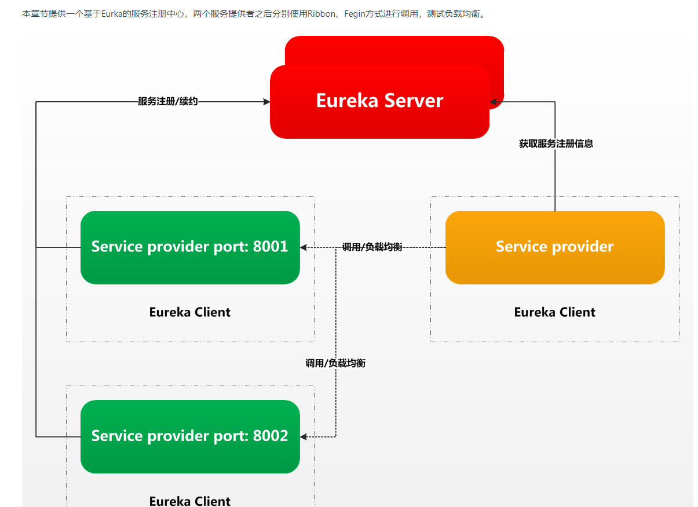
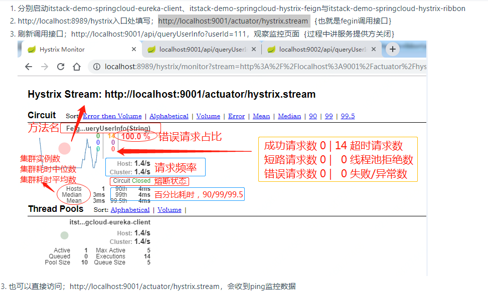
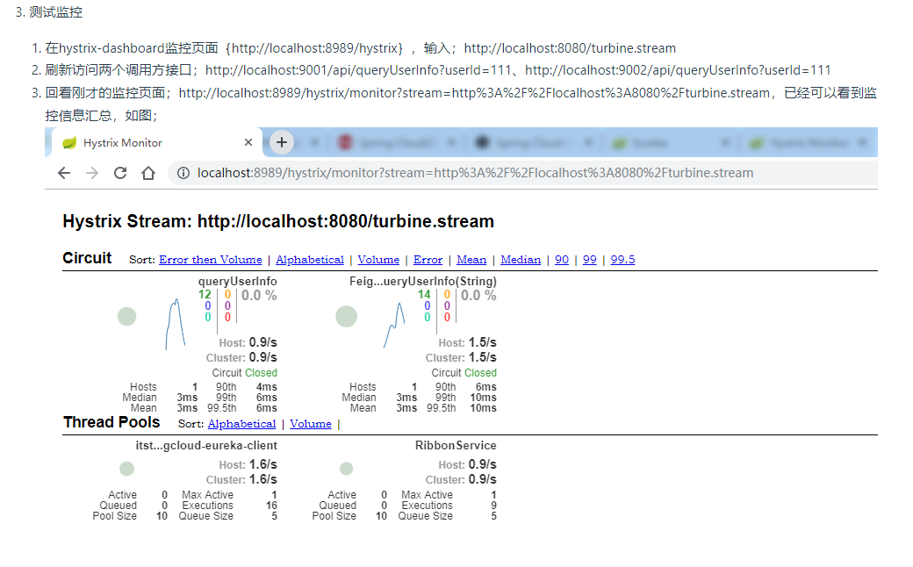
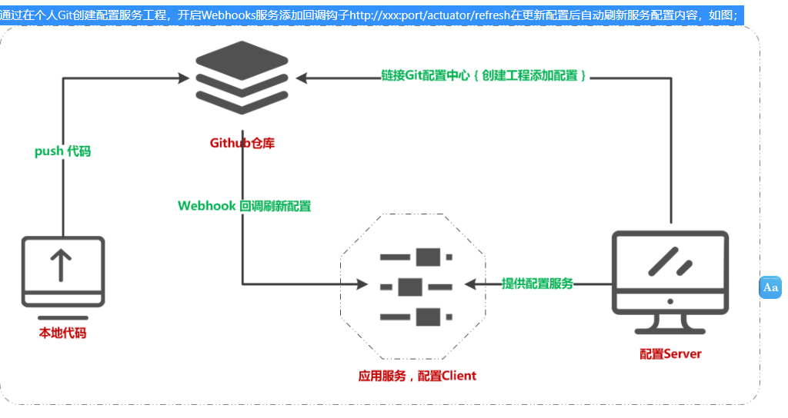
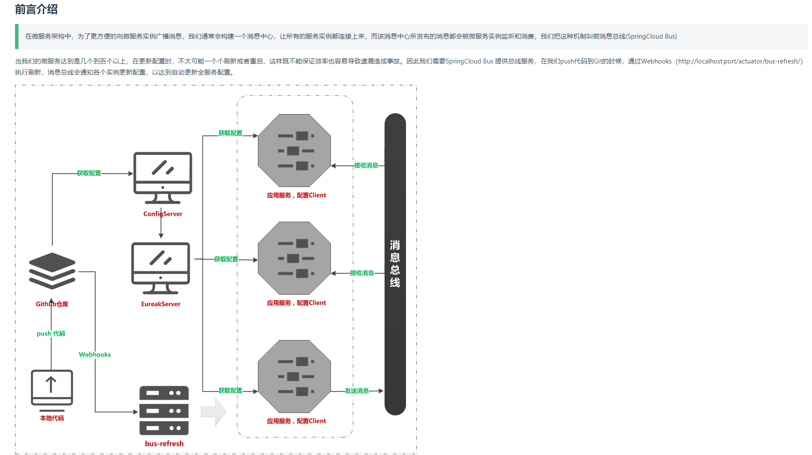

bugstak虫洞栈
学习地址：https://bugstack.cn/md/spring/spring-cloud/
springcloud环境配置：

Spring Boot ：2.0.3.RELEASE

Spring Cloud ：Finchley.SR2

#chapter2 服务提供与负载均衡调用 Eureka

Ribbon是一个基于 HTTP 和 TCP 的客户端负载均衡器。它可以通过在客户端中配置 ribbonServerList 来设置服务端列表去轮询访问以达到均衡负载的作用。

Feign 是一个声明式的 Web Service 客户端，它的目的就是让 Web Service 调用更加简单。它整合了 Ribbon 和 Hystrix，从而让我们不再需要显式地使用这两个组件。
#chapter3 应用服务快速失败熔断降级保护 Hystrix

在互联网开发中经常会听到雪崩效应，比如某明星发一些状态某猿就要回去加班了！那么为了应对雪崩我们经常会进行服务扩容、添加缓存、优化流程但往往突发的事件依然有击穿缓存、应用负载、数据库IO、网络异常等等带来的风险，所以一些常见的做法有服务降级、限流、熔断，在逐步恢复系统可用率来保护系统。

Hystrix 是一种熔断降级的中间件，由 Spring Cloud 集成整合后在Ribbon与Fegin中提供使用。

# 案例说明
本案例在chapter2的基础上添加Hystrix服务，当我们的itstack-demo-springcloud-eureka-client尚未启动或主动停止后，我们在调用接口服务时候会进行熔断保护。

# itstack-demo-springcloud-feign | Feign服务调用方，添加熔断Hystrix
Feign 是一个声明式的 Web Service 客户端，它的目的就是让 Web Service 调用更加简单。它整合了 Ribbon 和 Hystrix，从而让我们不再需要显式地使用这两个组件。Feign 还提供了 HTTP 请求的模板，通过编写简单的接口和插入注解，我们就可以定义好 HTTP 请求的参数、格式、地址等信息。接下来，Feign 会完全代理 HTTP 的请求，我们只需要像调用方法一样调用它就可以完成服务请求。

Feign 具有如下特性：

可插拔的注解支持，包括 Feign 注解和 JAX-RS 注解 支持可插拔的 HTTP 编码器和解码器 支持 Hystrix 和它的 Fallback 支持 Ribbon 的负载均衡 支持 HTTP 请求和响应的压缩

service/FeignService.java | 注解方式调用，方便易用。@FeignClient会在调用时进行解析服务到具体的http://ip:port/

#chapter4 服务响应性能成功率监控 Hystrix

#案例说明
结合上一章节案例，通过添加配置启动Hystrix Dashboard，来监控服务实时运行状态；服务信息、接口名、调用次数、响应时间、可用率、延迟、熔断状态等。

hystrixDashboard原理：Spring Cloud Hystrix Dashboard的底层原理是间隔一定时间去“Ping”目标服务，返回的结果是最新的监控数据，最后将数据显示出来。

#chapter5 turbine 监控信息聚合展示
如果有几百个接口，不可能一个个输入到dashborad中进行监控，此时，使用turbine聚合展示

#chapter6 基于github webhook动态刷新服务配置
问题背景：
在实际开发中经常会有一个叫做配置中心的服务，这个服务经过变更参数来动态刷新线上业务数据行为配置。比如；行为开关、活动数据、黑白名单、本地/预发/线上环境切换等等，这些配置信息往往需要在我们不重启系统的时候就可以被更新执行。那么我们一般会使用具备此类属性在分布式系统中适合的组件进行开发配置中心，像是zookeeper、redis发布订阅、或者http定时轮许拉取，他们都可以做成统一配置中心服务。而在Spring Cloud Config 中，默认采用 Git 来存储配置信息，所以使用 Spring Cloud Config 构建的配置服务器，天然就支持对微服务应用配置信息的版本管理，在加上Github的Webhook钩子服务，可以在我们push等行为操作的时候，自动执行我们的http行为，以达到自动刷新配置服务

#案例说明 

#chapter7 基于RabbitMQ消息总线方式刷新配置服务

